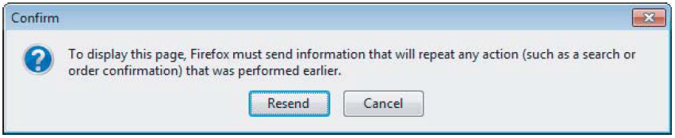

> **[Home](https://github.com/RakeshKengale/RaKKeN)  /  HTTP Methods**

## HTTP Methods

When you are attacking web applications, you will be dealing almost exclusively with the most commonly used methods: __GET__ and __POST__. You need to be aware of some important differences between these methods, as they can affect an application’s security if overlooked.

#### GET
#### POST
#### HEAD
#### TRACE
#### OPTIONS (Dangerous Method)
#### PUT (Dangerous Method)
#### DELETE (Dangerous Method)
#### COPY
#### MOVE (Dangerous Method)
#### SEARCH
#### PROFIND

### GET

The __GET__ method is designed to retrieve resources. It can be used to send parameters to the requested resource in the URL query string. This enables users to bookmark a URL for a dynamic resource that they can reuse. Or other users can retrieve the equivalent resource on a subsequent occasion (as in a bookmarked search query). URLs are displayed on-screen and are logged in various places, such as the browser history and the web server’s access logs. They are also transmitted in the `Referer` header to other sites when external links are followed. For these reasons, the query string should not be used to transmit any sensitive information.

### POST

The __POST__ method is designed to perform actions. With this method, request parameters can be sent both in the URL query string and in the body of the message. Although the URL can still be bookmarked, any parameters sent in the message body will be excluded from the bookmark. These parameters will also be excluded from the various locations in which logs of URLs are maintained and from the __Referer__ header. Because the POST method is designed for performing actions, if a user clicks the browser’s Back button to return to a page that was accessed using this method, the browser does not automatically reissue the request. Instead, it warns the user of what it is about to do. This prevents users from unwittingly performing an action more than once. For this reason, POST requests should always be used when an action is being performed.

##### Here is an example: 



### HEAD 

HEAD functions in the same way as a GET request, except that the server should not return a message body in its response. The server should return the same headers that it would have returned to the corresponding GET request. Hence, this method can be used to check whether a resource is present before making a GET request for it.
 
### TRACE 
 
TRACE is designed for diagnostic purposes. The server should return in the response body the exact contents of the request message it received. This can be used to detect the effect of any proxy servers between the client and server that may manipulate the request.

### OPTIONS 

OPTIONS asks the server to report the HTTP methods that are available for a particular resource. The server typically returns a response containing an Allow header that lists the available methods. You can use the OPTIONS method to list the HTTP methods that are permitted in a particular directory:

##### Here is an example: 

>  Request 

```
OPTIONS /public/ HTTP/1.0
Host: example.com
```
> Response

```
HTTP/1.1 200 OK
Connection: close
Date: Sun, 10 Apr 2020 15:56:27 GMT
Server: Microsoft-IIS/6.0
MicrosoftOfficeWebServer: 5.0_Pub
X-Powered-By: ASP.NET
MS-Author-Via: MS-FP/4.0,DAV
Content-Length: 0
Accept-Ranges: none
DASL: <DAV:sql>
DAV: 1, 2
Public: OPTIONS, TRACE, GET, HEAD, DELETE, PUT, POST, COPY, MOVE, MKCOL, PROPFIND, PROPPATCH, LOCK, UNLOCK, SEARCH
Allow: OPTIONS, TRACE, GET, HEAD, COPY, PROPFIND, SEARCH, LOCK, UNLOCK
Cache-Control: private
```
This response indicates that several of the powerful methods listed previously are in fact allowed. However, in practice these may require authentication or be subject to other restrictions.


Many other HTTP methods exist that are not directly relevant to attacking web applications. However, a web server may expose itself to attack if certain dangerous methods are available.

## WebDAV Methods

WebDAV is a term given to a collection of HTTP methods used for Web-based Distributed Authoring and Versioning. These have been widely available since 1996. They have been more recently adopted in cloud storage and collaboration applications, where user data needs to be accessed across systems using an existing fi rewall-friendly protocol such as HTTP. HTTP requests can use a range of methods other than the standard GET and POST methods. WebDAV adds numerous others that can be used to manipulate files on the web server. Given the nature of the functionality, if these are accessible by low-privileged users, they may provide an effective avenue for attacking an application. Here are some methods to look for:

### PUT 

PUT attempts to upload the specified resource to the server, using the content contained in the body of the request. If this method is enabled, you may be able to leverage it to attack the application, such as by uploading an arbitrary script and executing it on the server. The HTTP PUT request method creates a new resource or replaces a representation of the target resource with the request payload. PUT uploads the attached file to the specified location. The PUT method is particularly dangerous. If you upload arbitrary fi les within the web root, the fi rst target is to create a backdoor script on the server that will be executed by a server-side module, thereby giving the attacker full control of the application, and often the web server itself. If the PUT method appears to be present and enabled, you can verify this as follows:

##### Here is an example: 

>  Request 
```
PUT /new.html HTTP/1.1
Host: example.com
Content-type: text/html
Content-length: 16

<p>New File</p>
```

> Response
If the target resource does not have a current representation and the PUT request successfully creates one, then the origin server must inform the user agent by sending a 201 (Created) response.
```
HTTP/1.1 201 Created
Content-Location: /new.html
```

If the target resource does have a current representation and that representation is successfully modified in accordance with the state of the enclosed representation, then the origin server must send either a 200 (OK) or a 204 (No Content) response to indicate successful completion of the request.
```
HTTP/1.1 204 No Content
Content-Location: /existing.html
```

### DELETE 

The HTTP DELETE request method deletes the specified resource.

##### Here is an example: 

>  Request 
```
DELETE /file.html HTTP/1.1
```
> Response
If a DELETE method is successfully applied, there are several response status codes possible:

- A 202 (Accepted) status code if the action will likely succeed but has not yet been enacted.
- A 204 (No Content) status code if the action has been enacted and no further information is to be supplied.
- A 200 (OK) status code if the action has been enacted and the response message includes a representation describing the status.
```
HTTP/1.1 200 OK 
Date: Wed, 21 Oct 2015 07:28:00 GMT

<html>
  <body>
    <h1>File deleted.</h1> 
  </body>
</html>
```

### COPY 

copies the specified resource to the location given in the Destination header.

##### Here is an example: 

>  Request 

```
COPY /~username/index.html HTTP/1.1
Host: www.example.com
Destination:  http://www.example.com/~username/folder/index.html
Overwrite: T
```
> Response

```
HTTP/1.1 201 Created
```

### MOVE 

moves the specifi ed resource to the location given in the Destination header.

##### Here is an example: 

>  Request 

```
MOVE /pub2/folder1/ HTTP/1.1
Destination: http://www.example.com/pub2/folder2/
Host: www.example.com
```
> Response

```
HTTP/1.1 201 Created
Location: http://www.example.com/pub2/folder2/
```

### SEARCH 

searches a directory path for resources.

##### Here is an example: 

>  Request 

```
SEARCH /vroot/folder/ HTTP/1.1
Content-Type: text/xml
Content-Length: XXX
Host: server.tld
...

<?xml version="1.0"?>
<D:searchrequest xmlns:D = "DAV:">
   <D:sql>
   SELECT "DAV:contentclass", "DAV:displayname"
   FROM "/vroot/folder/"
   WHERE "DAV:ishidden" = false
     AND "DAV:isfolder" = false
   </D:sql>
</D:searchrequest>
```
> Response

```
SEARCH /vroot/folder/ HTTP/1.1
HTTP/1.1 207 Multi-Status
Server: Microsoft-IIS/5.0
Date: Thu, 09 Mar 2000 06:36:40 GMT
WWW-Authenticate: Negotiate XXXX
Content-Type: text/xmlAccept-Ranges: rowsTransfer-Encoding: chunked
<?xml version="1.0"?><a:multistatus xmlns:b="urn:uuid:c2f41010-65b3-11d1-a29f-00aa00c14882/" xmlns:a="DAV:">
 <a:response>
   <a:href>http://server.tld/vroot/folder/item2.txt</a:href>
   <a:propstat>
     <a:status>HTTP/1.1 200 OK</a:status>
     <a:prop>
         <a:contentclass>urn:content-classes:document</a:contentclass>
         <a:displayname>item2.txt</a:displayname>
      </a:prop>
   </a:propstat>
 </a:response>
 <a:response>
   <a:href>http://server.tld/vroot/folder/item1.txt</a:href>
   <a:propstat>
     <a:status>HTTP/1.1 200 OK</a:status>
     <a:prop>
        <a:contentclass>urn:content-classes:document</a:contentclass>
        <a:displayname>item1.txt</a:displayname>
     </a:prop>
   </a:propstat>
 </a:response>
</a:multistatus>
```

### PROPFIND 

retrieves information about the specified resource, such as author, size, and content type.

##### Here is an example: 

>  Request 

```
PROPFIND /public/docs/myFile.doc HTTP/1.1
Content-Type: text/xml
Content-Length: XXX
Depth: 0
Translate: f
...

<?xml version="1.0"?>
<a:propfind xmlns:a="DAV:">
<a:prop><a:getcontenttype/></a:prop>
<a:prop><a:getcontentlength/></a:prop>
</a:propfind>
```
> Response

```
HTTP/1.1 207 Multi-Status
Content-Type: text/xml
Content-Length: 310

<?xml version="1.0"?>
<a:multistatus
  xmlns:b="urn:uuid:c2f41010-65b3-11d1-a29f-00aa00c14882/"
  xmlns:a="DAV:">
 <a:response>
   <a:href>http://server/public/test2/item1.txt</a:href>
   <a:propstat>
    <a:status>HTTP/1.1 200 OK</a:status>
       <a:prop>
        <a:getcontenttype>text/plain</a:getcontenttype>
        <a:getcontentlength b:dt="int">33</a:getcontentlength>
       </a:prop>
   </a:propstat>
 </a:response>
</a:multistatus>
```

Reference

- [WebDev](https://en.wikipedia.org/wiki/WebDAV)